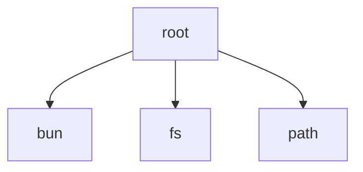

# Root Module

[← Back to INDEX](../../INDEX.md)

**Type:** root | **Files:** 33

## Files

| File | Lines | Large |
| ---- | ----- | ----- |
| `Quotio/QuotioApp.swift` | 818 | 📊 |
| `Quotio/Services/AgentConfigurationService.swift` | 1940 | 📊 |
| `Quotio/Services/AgentDetectionService.swift` | 293 |  |
| `Quotio/Services/AtomFeedUpdateService.swift` | 533 | 📊 |
| `Quotio/Services/CLIExecutor.swift` | 430 |  |
| `Quotio/Services/ChecksumVerifier.swift` | 78 |  |
| `Quotio/Services/CompatibilityChecker.swift` | 123 |  |
| `Quotio/Services/CustomProviderService.swift` | 340 |  |
| `Quotio/Services/DirectAuthFileService.swift` | 493 |  |
| `Quotio/Services/FallbackSettingsManager.swift` | 367 |  |
| `Quotio/Services/GLMQuotaFetcher.swift` | 186 |  |
| `Quotio/Services/ImageCacheService.swift` | 141 |  |
| `Quotio/Services/KeychainHelper.swift` | 225 |  |
| `Quotio/Services/LanguageManager.swift` | 115 |  |
| `Quotio/Services/LaunchAtLoginManager.swift` | 189 |  |
| `Quotio/Services/Logger.swift` | 124 |  |
| `Quotio/Services/ManagementAPIClient.swift` | 732 | 📊 |
| `Quotio/Services/NotificationManager.swift` | 334 |  |
| `Quotio/Services/ProxyConfigurationService.swift` | 96 |  |
| `Quotio/Services/RequestTracker.swift` | 194 |  |
| `Quotio/Services/ShellProfileManager.swift` | 121 |  |
| `Quotio/Services/StatusBarManager.swift` | 272 |  |
| `Quotio/Services/StatusBarMenuBuilder.swift` | 1470 | 📊 |
| `Quotio/Services/Tunnel/CloudflaredService.swift` | 266 |  |
| `Quotio/Services/Tunnel/TunnelManager.swift` | 254 |  |
| `Quotio/Services/UpdaterService.swift` | 168 |  |
| `Quotio/Services/WarmupService.swift` | 185 |  |
| `Quotio/Services/WarpService.swift` | 83 |  |
| `Quotio/ViewModels/AgentSetupViewModel.swift` | 593 | 📊 |
| `Quotio/ViewModels/LogsViewModel.swift` | 82 |  |
| `Quotio/ViewModels/QuotaViewModel.swift` | 1936 | 📊 |
| `scripts/capture-screenshots.ts` | 763 | 📊 |
| `scripts/test_effort_translator.swift` | 240 |  |

## Documentation

- [outline.md](outline.md) - Symbol maps for large files
- [memory.md](memory.md) - Warnings and TODOs

---

```mermaid
graph TD
    root[root] --> bun[bun]
    root[root] --> fs[fs]
    root[root] --> path[path]
```

## External Dependencies

Dependencies from other modules:

- `bun`
- `fs`
- `path`
