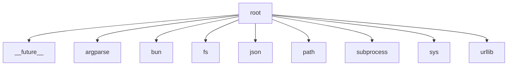

# Imports

[← Back to MODULE](MODULE.md) | [← Back to INDEX](../../INDEX.md)

## Dependency Graph

## External Dependencies

Dependencies from other modules:

- `__future__`
- `argparse`
- `bun`
- `fs`
- `json`
- `path`
- `subprocess`
- `sys`
- `urllib`

