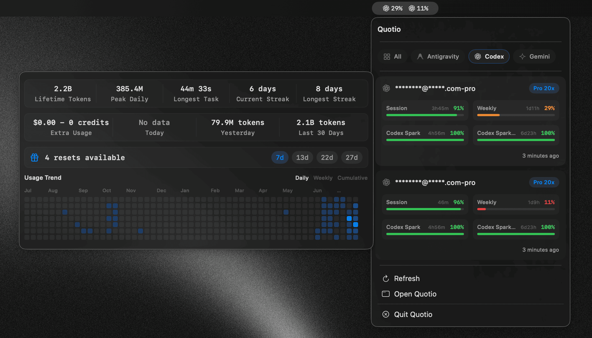
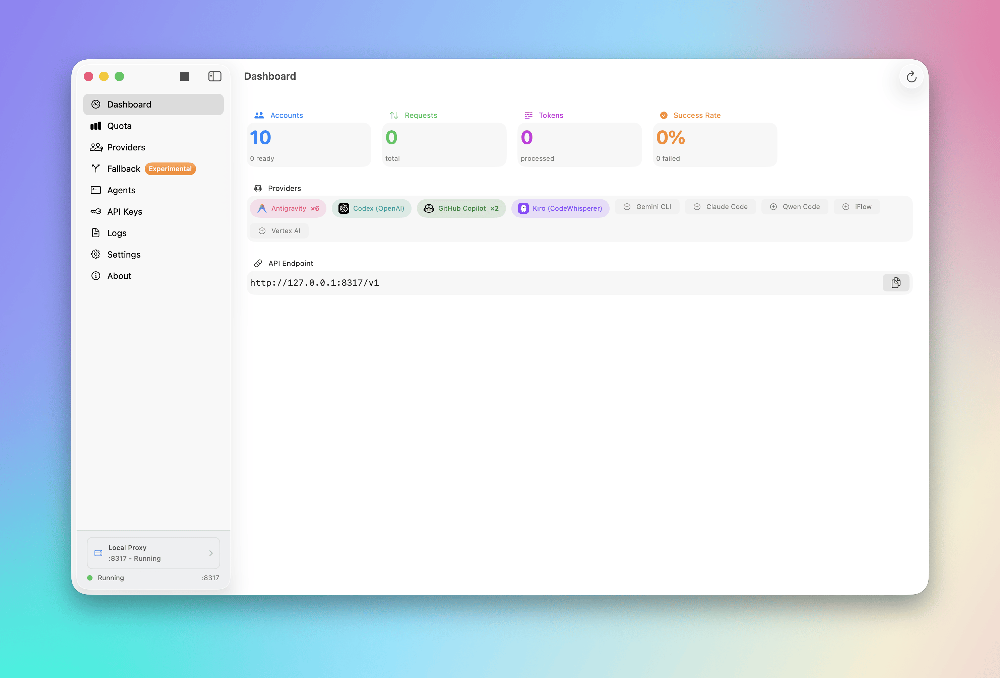
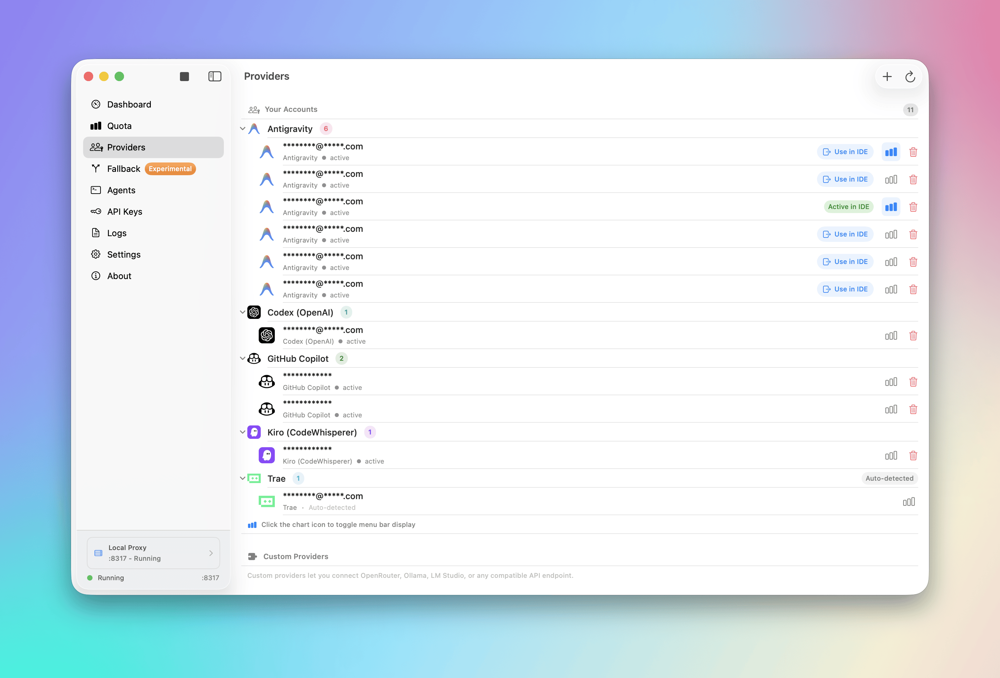
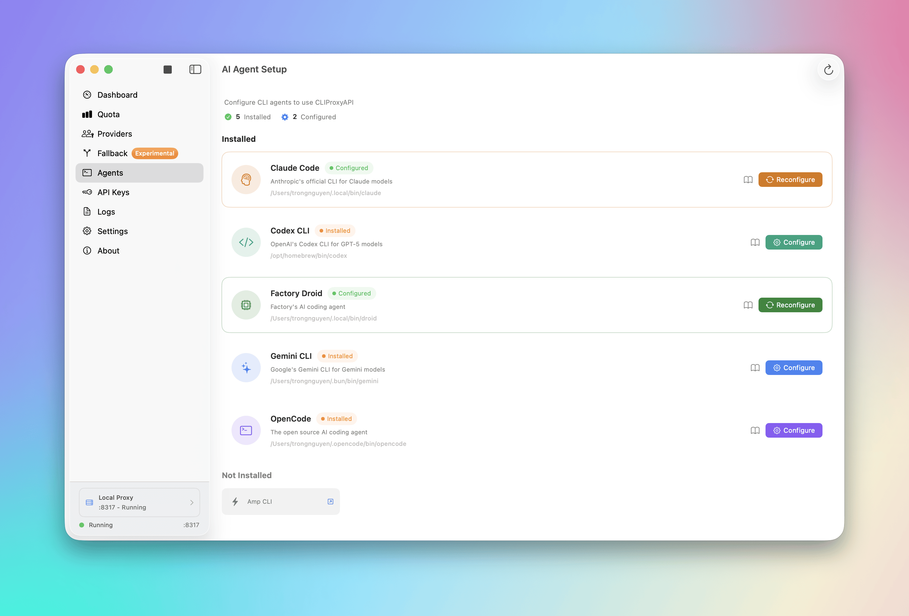
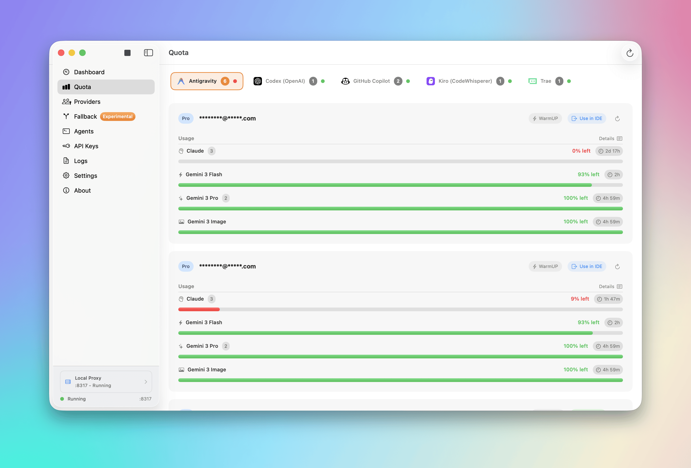
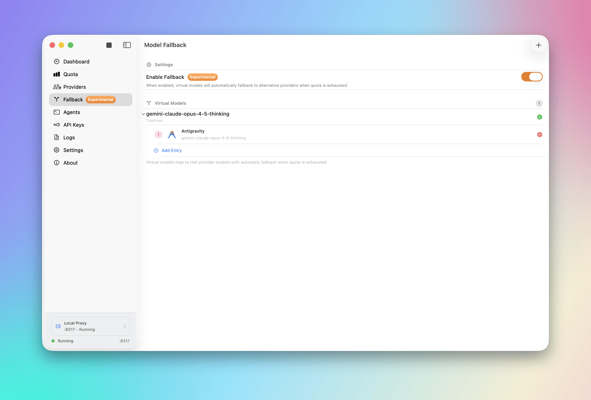
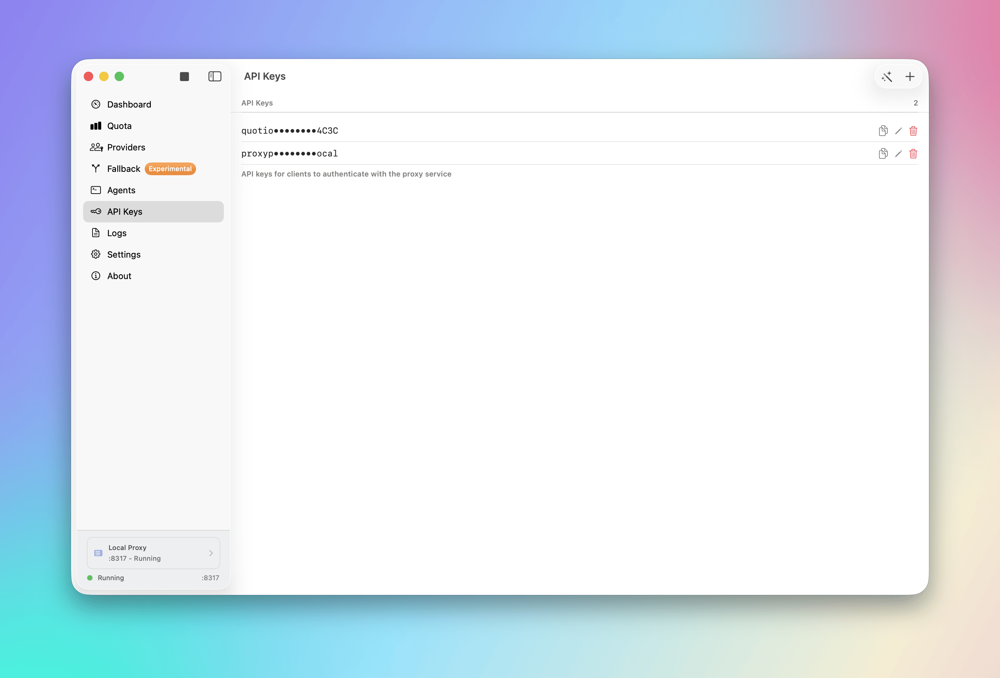
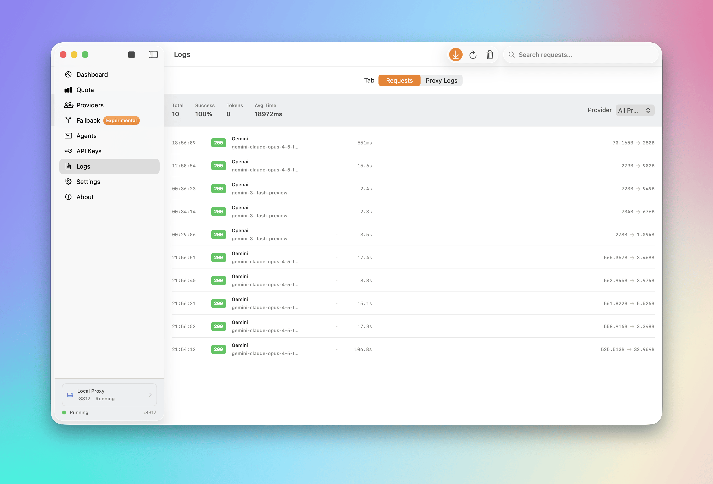
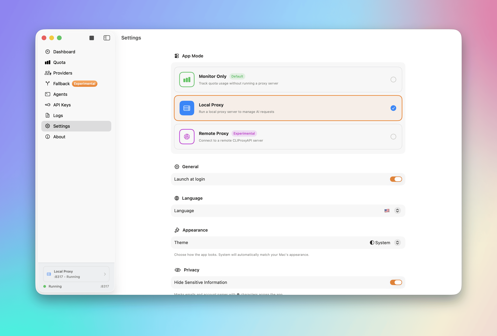

# Quotio

<p align="center">
  <picture>
    <source media="(prefers-color-scheme: dark)" srcset="screenshots/menu_bar_dark.png" />
    <source media="(prefers-color-scheme: light)" srcset="screenshots/menu_bar.png" />
    
  </picture>
</p>

<p align="center">
  
  
  
  <a href="https://discord.gg/dFzeZ7qS"></a>
  <a href="README.ru.md"></a>
  <a href="README.vi.md"></a>
  <a href="README.zh.md"></a>
  <a href="README.fr.md"></a>
</p>

<p align="center">
  <strong>The ultimate command center for your AI coding assistants on macOS.</strong>
</p>

Quotio is a native macOS application for managing **CLIProxyAPI** - a local proxy server that powers your AI coding agents. It helps you manage multiple AI accounts, track quotas, and configure CLI tools in one place.

## ✨ Features

- **🔌 Multi-Provider Support**: Connect accounts from Gemini, Claude, OpenAI Codex, Qwen, Vertex AI, iFlow, Antigravity, Kiro, Trae, and GitHub Copilot via OAuth or API keys.
- **📊 Standalone Quota Mode**: View quota and accounts without running the proxy server - perfect for quick checks.
- **🚀 One-Click Agent Configuration**: Auto-detect and configure AI coding tools like Claude Code, OpenCode, Gemini CLI, and more.
- **📈 Real-time Dashboard**: Monitor request traffic, token usage, and success rates live.
- **📉 Smart Quota Management**: Visual quota tracking per account with automatic failover strategies (Round Robin / Fill First).
- **🔑 API Key Management**: Generate and manage API keys for your local proxy.
- **🖥️ Menu Bar Integration**: Quick access to server status, quota overview, and custom provider icons from your menu bar.
- **🔔 Notifications**: Alerts for low quotas, account cooling periods, or service issues.
- **🔄 Auto-Update**: Built-in Sparkle updater for seamless updates.
- **🌍 Multilingual**: English, Vietnamese, and Simplified Chinese support.

## 🤖 Supported Ecosystem

### AI Providers
| Provider | Auth Method |
|----------|-------------|
| Google Gemini | OAuth |
| Anthropic Claude | OAuth |
| OpenAI Codex | OAuth |
| Qwen Code | OAuth |
| Vertex AI | Service Account JSON |
| iFlow | OAuth |
| Antigravity | OAuth |
| Kiro | OAuth |
| GitHub Copilot | OAuth |

### IDE Quota Tracking (Monitor Only)
| IDE | Description |
|-----|-------------|
| Cursor | Auto-detected when installed and logged in |
| Trae | Auto-detected when installed and logged in |

> **Note**: These IDEs are only used for quota usage monitoring. They cannot be used as providers for the proxy.

### Compatible CLI Agents
Quotio can automatically configure these tools to use your centralized proxy:
- Claude Code
- Codex CLI
- Gemini CLI
- Amp CLI
- OpenCode
- Factory Droid

## 🚀 Installation

### Requirements
- macOS 14.0 (Sonoma) or later
- Internet connection for OAuth authentication

### Homebrew (Recommended)
```bash
brew tap nguyenphutrong/tap
brew install --cask quotio
```

### Download
Download the latest `.dmg` from the [Releases](https://github.com/nguyenphutrong/quotio/releases) page.

> ⚠️ **Note**: The app is not signed with an Apple Developer certificate yet. If macOS blocks the app, run:
> ```bash
> xattr -cr /Applications/Quotio.app
> ```

### Building from Source

1. **Clone the repository:**
   ```bash
   git clone https://github.com/nguyenphutrong/quotio.git
   cd Quotio
   ```

2. **Open in Xcode:**
   ```bash
   open Quotio.xcodeproj
   ```

3. **Build and Run:**
   - Select the "Quotio" scheme
   - Press `Cmd + R` to build and run

> The app will automatically download the `CLIProxyAPI` binary on first launch.

## 📖 Usage

### 1. Start the Server
Launch Quotio and click **Start** on the dashboard to initialize the local proxy server.

### 2. Connect Accounts
Go to **Providers** tab → Click on a provider → Authenticate via OAuth or import credentials.

### 3. Configure Agents
Go to **Agents** tab → Select an installed agent → Click **Configure** → Choose Automatic or Manual mode.

### 4. Monitor Usage
- **Dashboard**: Overall health and traffic
- **Quota**: Per-account usage breakdown
- **Logs**: Raw request/response logs for debugging

## ⚙️ Settings

- **Port**: Change the proxy listening port
- **Routing Strategy**: Round Robin or Fill First
- **Auto-start**: Launch proxy automatically when Quotio opens
- **Notifications**: Toggle alerts for various events

## 📸 Screenshots

### Dashboard
<picture>
  <source media="(prefers-color-scheme: dark)" srcset="screenshots/dashboard_dark.png" />
  <source media="(prefers-color-scheme: light)" srcset="screenshots/dashboard.png" />
  
</picture>

### Providers
<picture>
  <source media="(prefers-color-scheme: dark)" srcset="screenshots/provider_dark.png" />
  <source media="(prefers-color-scheme: light)" srcset="screenshots/provider.png" />
  
</picture>

### Agent Setup
<picture>
  <source media="(prefers-color-scheme: dark)" srcset="screenshots/agent_setup_dark.png" />
  <source media="(prefers-color-scheme: light)" srcset="screenshots/agent_setup.png" />
  
</picture>

### Quota Monitoring
<picture>
  <source media="(prefers-color-scheme: dark)" srcset="screenshots/quota_dark.png" />
  <source media="(prefers-color-scheme: light)" srcset="screenshots/quota.png" />
  
</picture>

### Fallback Configuration
<picture>
  <source media="(prefers-color-scheme: dark)" srcset="screenshots/fallback_dark.png" />
  <source media="(prefers-color-scheme: light)" srcset="screenshots/fallback.png" />
  
</picture>

### API Keys
<picture>
  <source media="(prefers-color-scheme: dark)" srcset="screenshots/api_keys_dark.png" />
  <source media="(prefers-color-scheme: light)" srcset="screenshots/api_keys.png" />
  
</picture>

### Logs
<picture>
  <source media="(prefers-color-scheme: dark)" srcset="screenshots/logs_dark.png" />
  <source media="(prefers-color-scheme: light)" srcset="screenshots/logs.png" />
  
</picture>

### Settings
<picture>
  <source media="(prefers-color-scheme: dark)" srcset="screenshots/settings_dark.png" />
  <source media="(prefers-color-scheme: light)" srcset="screenshots/settings.png" />
  
</picture>

### Menu Bar
<picture>
  <source media="(prefers-color-scheme: dark)" srcset="screenshots/menu_bar_dark.png" />
  <source media="(prefers-color-scheme: light)" srcset="screenshots/menu_bar.png" />
  
</picture>

## 🤝 Contributing

1. Fork the Project
2. Create your Feature Branch (`git checkout -b feature/amazing-feature`)
3. Commit your Changes (`git commit -m 'Add amazing feature'`)
4. Push to the Branch (`git push origin feature/amazing-feature`)
5. Open a Pull Request

## 💬 Community

Join our Discord community to get help, share feedback, and connect with other users:

<a href="https://discord.gg/dFzeZ7qS">
  
</a>

## ⭐ Star History

<picture>
  <source
    media="(prefers-color-scheme: dark)"
    srcset="
      https://api.star-history.com/svg?repos=nguyenphutrong/quotio&type=Date&theme=dark
    "
  />
  <source
    media="(prefers-color-scheme: light)"
    srcset="
      https://api.star-history.com/svg?repos=nguyenphutrong/quotio&type=Date
    "
  />
  
</picture>

## 📊 Repo Activity


## 💖 Contributors

We couldn't have done this without you. Thank you! 🙏

<a href="https://github.com/nguyenphutrong/quotio/graphs/contributors">
  
</a>

## 📄 License

MIT License. See `LICENSE` for details.
