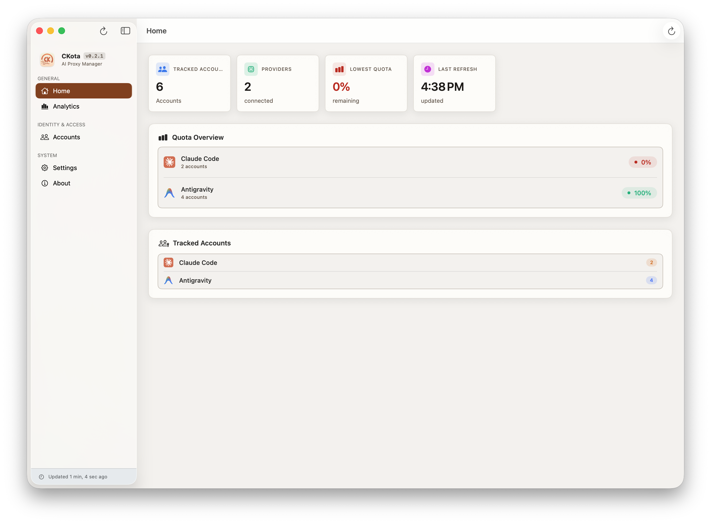
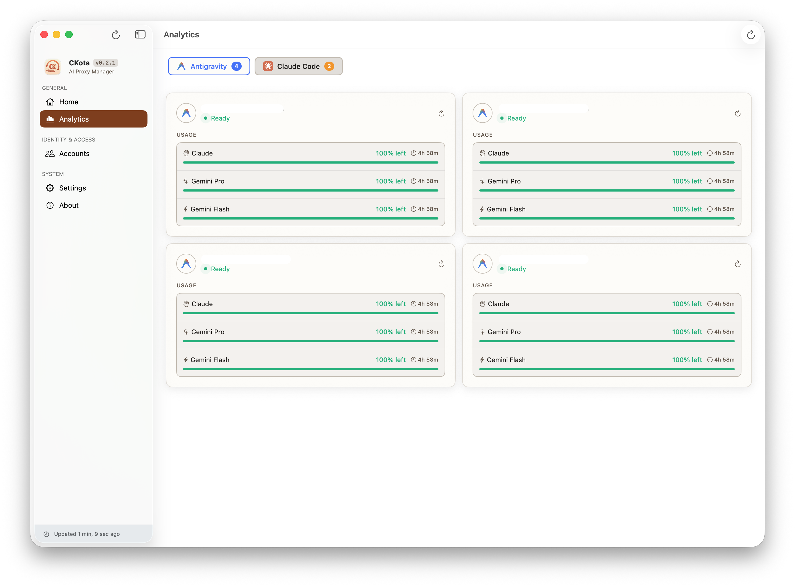
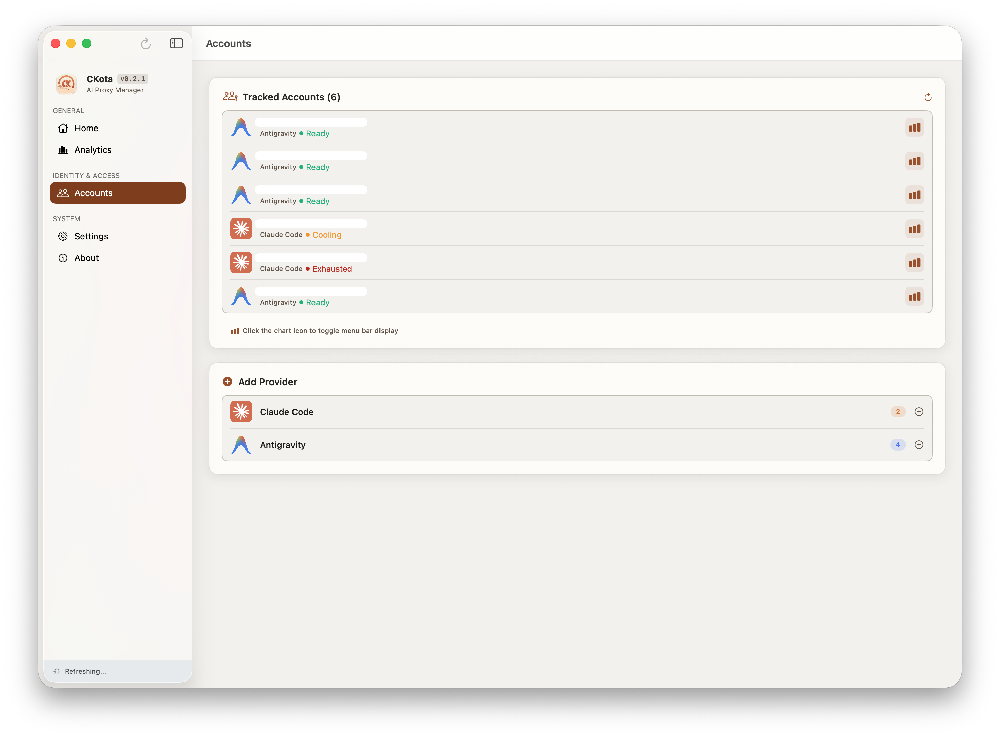
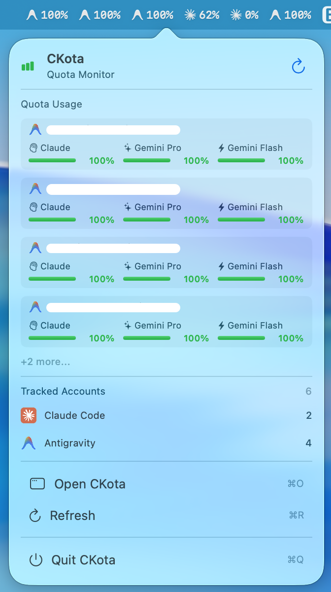

# CKota

<p align="center">
  
</p>

<p align="center">
  
  
  
  <a href="README.md"></a>
</p>

Ứng dụng menu bar macOS để quản lý tài khoản AI coding. CKota bọc [CLIProxyAPI](https://github.com/synh/CLIProxyAPI) - proxy cục bộ phân phối request qua nhiều tài khoản provider.

Theo dõi quota của Claude Code, Antigravity, Gemini, Codex, Copilot và nhiều hơn nữa. Xem ngay tài khoản nào sẵn sàng, đang nghỉ, hay đã hết quota.

**v0.2.2** | macOS 15.0+ | [Tài liệu](./docs/)

## Cài đặt

Tải [bản release mới nhất](https://github.com/synh/CKota/releases) hoặc build từ source:

```bash
git clone https://github.com/synh/CKota.git
cd CKota && open CKota.xcodeproj
# Cmd + R để build và chạy
```

Binary proxy tự động tải về khi chạy lần đầu.

## Ảnh chụp màn hình

| Trang chủ | Phân tích |
|-----------|-----------|
|  |  |

| Tài khoản | Cài đặt |
|-----------|---------|
|  |  |

<p align="center">
  
</p>

## Chức năng

**Hai chế độ:**
- **Full Mode** - Chạy proxy server, quản lý tài khoản, cấu hình CLI agent
- **Quota Monitor** - Chỉ theo dõi quota, không chạy proxy (nhẹ hơn)

**Quản lý tài khoản:**
- Đăng nhập OAuth cho các provider được hỗ trợ (Claude, Antigravity, v.v.)
- Trạng thái: Sẵn sàng (xanh), Đang nghỉ (cam), Hết quota (đỏ)
- Chi tiết quota từng tài khoản kèm thời gian reset

**Menu bar:**
- Xem nhanh các tài khoản quota thấp nhất
- Icon màu hoặc đơn sắc tùy chọn

## Provider

Claude Code, Antigravity

## Cách dùng

1. Khởi động CKota, chọn Full Mode hoặc Quota Monitor
2. Vào **Accounts** và thêm tài khoản provider qua OAuth
3. Xem **Analytics** để theo dõi chi tiết quota từng tài khoản
4. Menu bar hiển thị các tài khoản hàng đầu

Cài đặt cho phép cấu hình ngôn ngữ (EN/VI), giao diện, khởi động cùng hệ thống, và thông báo.

## Kiến trúc

SwiftUI + MVVM với async/await. Ứng dụng giao tiếp với CLIProxyAPI qua REST để quản lý tài khoản và lấy quota.

```
Views → ViewModels (@Observable) → Services → CLIProxyAPI
```

File quan trọng:
- `CKotaApp.swift` - Entry point, setup menu bar
- `ViewModels/QuotaViewModel.swift` - State trung tâm
- `Services/CLIProxyManager.swift` - Quản lý vòng đời proxy
- `Services/*QuotaFetcher.swift` - API quota theo provider

## Tài liệu

- [Tổng quan dự án](docs/project-overview-pdr.md)
- [Quy chuẩn code](docs/code-standards.md)
- [Kiến trúc hệ thống](docs/system-architecture.md)
- [Tóm tắt codebase](docs/codebase-summary.md)

## Đóng góp

Fork, tạo nhánh, PR. Tuân thủ [quy chuẩn code](docs/code-standards.md). Xem [CLAUDE.md](CLAUDE.md) cho quy trình phát triển.

## Giấy phép

MIT
